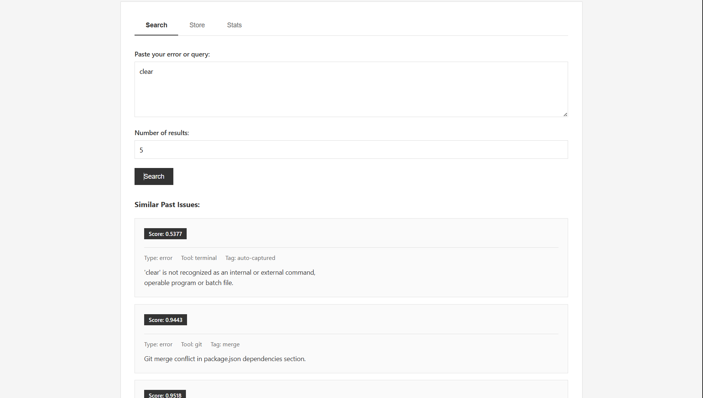

# GitBrain - Developer Memory System

AI-powered developer assistant using semantic vector search with Endee database.

---

## Quick Deploy with Docker
```bash
# Start everything
docker-compose up -d

# Initialize database (first time)
docker-compose exec gitbrain python init_db.py

# Access at http://localhost:5000
```

---

## Features

- **Semantic Search**: Find similar errors using vector similarity
- **Web Interface**: Clean dashboard for search and storage
- **Terminal Agent**: Interactive CLI
- **Auto-Capture**: Monitor terminal errors
- **Dockerized**: Deploy anywhere

---

## Screenshots

### Web Search Interface


### Search Results



### Terminal Monitor


---

## Local Development

### Prerequisites

- Python 3.8+
- Endee running on port 8081

### Setup
```bash
# Install dependencies
pip install -r requirements.txt

# Start Endee
docker run -d -p 8081:8081 endeeai/endee:latest

# Initialize
python fix_index.py
python insert_vector.py

# Run
python web_app.py
```

---

## Project Structure
```
gitbrain/
├── web_app.py           # Flask web interface
├── agent.py             # Terminal agent
├── terminal_monitor.py  # Auto-capture errors
├── fix_index.py         # Create index
├── insert_vector.py     # Insert sample data
├── init_db.py           # Docker initialization
├── config.py            # Configuration
├── Dockerfile           # Docker image
├── docker-compose.yml   # Complete stack
└── templates/
    └── index.html       # Web UI
```

---

## API Endpoints

- `POST /api/search` - Search similar memories
- `POST /api/store` - Store new memory
- `GET /api/stats` - System statistics

---

## Configuration

Edit `config.py` or set environment variables:
```python
ENDEE_BASE_URL = "http://localhost:8081/api/v1"
INDEX_NAME = "gitbrain"
WEB_PORT = 5000
```

---

## Usage

### Web Interface

1. Open `http://localhost:5000`
2. **Search**: Find similar past errors
3. **Store**: Add new memories
4. **Stats**: View system info

### Terminal Agent
```bash
python agent.py
```

### Terminal Monitor
```bash
python terminal_monitor.py
```

---

## Architecture
```
Query → Sentence Transformer (384D) → Endee Vector DB → Results
```

**Stack:**
- Embedding: all-MiniLM-L6-v2 (384D)
- Database: Endee (cosine similarity)
- Backend: Flask
- Frontend: Vanilla JS